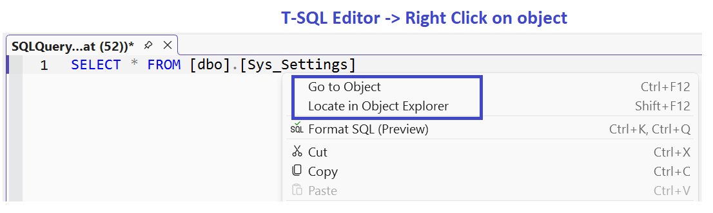
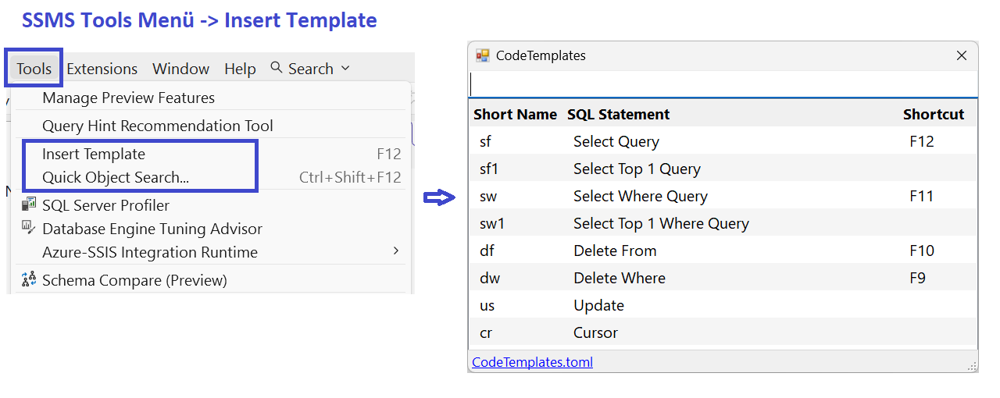

# TSqlJump

> A lightweight SSMS 22 extension that lets you jump from T-SQL code 
> to database objects — open scripts for tables, views, stored procedures, 
> functions and triggers, or locate them in Object Explorer with a single shortcut.


*Right-click any object name in the T-SQL editor to access TSqlJump commands.*

---

## Features

| Shortcut           | Action                                                              |
| ------------------ | ------------------------------------------------------------------- |
| `Ctrl+F12`         | **Go to Object** — Opens the object's script in a new query window  |
| `Ctrl+Shift+F12`   | **Locate in Object Explorer** — Highlights the object in OE         |
| `F12`              | **Insert Template** — Inserts a T-SQL snippet                       |

### Supported Object Types

- ✅ Tables
- ✅ Views
- ✅ Stored Procedures
- ✅ Scalar / Table-Valued / Inline Table-Valued Functions
- ✅ DML & CLR Triggers

### Screenshots

**Right-click menu in T-SQL editor:**


**Insert Template from Tools menu:**



---

## Installation

### Requirements

- **SSMS 22** (based on Visual Studio 2022 Shell)
- **.NET Framework 4.7.2+**

### Install via PowerShell

```powershell
& "C:\Program Files\Microsoft SQL Server Management Studio 22\Release\Common7\IDE\VSIXInstaller.exe" "TSqlJump.vsix"
```

Or simply **double-click** the `.vsix` file.

---

## Uninstallation

> ⚠️ **SSMS does not provide an "Extensions" menu** like Visual Studio does. 
> You cannot uninstall extensions via the UI. Use PowerShell instead.

### Uninstall via PowerShell

```powershell
& "C:\Program Files\Microsoft SQL Server Management Studio 22\Release\Common7\IDE\VSIXInstaller.exe" /uninstall:TSqlJump.0bf60e5c-56a0-4e73-b80b-1538cd279d71
```

The `/uninstall:` argument requires the **full extension ID** in the form:

```
<DisplayName>.<GUID>
```

You can find the exact ID in `source.extension.vsixmanifest`.

---

## Usage

Place your cursor over any object name in the SQL editor:

```sql
SELECT * FROM [dbo].[Sys_Settings]
--             ^^^^^^^^^^^^^^^ cursor anywhere here
```

Then press:

- **`Ctrl+F12`** → Opens the object's `ALTER` / `CREATE` script in a new query window.
- **`Ctrl+Shift+F12`** → Locates the object in **Object Explorer** (highlights it, ready for right-click actions like *Design*).
- **`F12`** → Opens the template selector.

---

## Templates

Templates are stored in a TOML file located at:

```
%LocalAppData%\TSqlJump\Templates.toml
```

Click the **"Templates.toml"** link in the template dialog to open it directly.

### Example Template

```toml
[[snippet]]
name = "Select Query"
shortName = "sf"
shortcut = "F12"
tsql = """
SELECT * FROM """

[[snippet]]
name = "Delete Where"
shortName = "dw"
shortcut = "F9"
tsql = """
DELETE FROM 
WHERE """
```

---

## "Locate in Object Explorer"

TSqlJump uses the **official Object Explorer navigation API** 
(`IObjectExplorerService.FindNode` + `SynchronizeTree`) to **highlight the object** 
in Object Explorer. From there, right-click → **Design** — one click away, 
and 100% compatible with all SSMS versions.

---

## Building from Source

```bash
git clone https://github.com/datakent/TSqlJump.git
cd TSqlJump
msbuild TSqlJump.csproj /p:Configuration=Release
```

Requires:
- Visual Studio 2022 (with VSIX workload)
- SSMS 22 installed (for reference assemblies)

---

## License

MIT © 2026 [datakent]

---

## Contributing

Pull requests welcome! For major changes, please open an issue first 
to discuss what you'd like to change.
